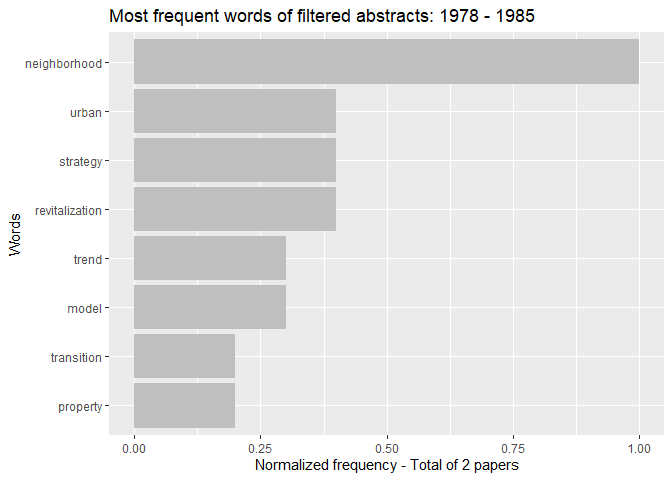

Historical Analysis of abstracts
================

This code was elaborated to evaluate the evolution of topics discussed
in the literature throughout the years. We divide the abstracts of the
papers in different corpus according to the year they were published and
perform a word frequency count.

#### Import libraries

``` r
library(tm)
library(NLP)
library(tidyverse)
library(tidytext)
library(readxl)
library(textstem)
library(skimr)
library(kableExtra)
```

#### 1. Import table

``` r
systematicreview <- read_excel("Data/table_systematic_review.xlsx")
```

-   `ID`: identification of paper.

-   `Historical_Analysis`: In the filtering process, the papers selected
    for the historical analysis were assigned in this column as “1”.
    Papers that were totally out of scope of the objective of the
    literature review were assigned as “0” and not included in this
    analysis.

-   `Specific_Analysis`: In the filtering process, papers that were
    selected for full paper analysis through topic modelling, bigrams
    and qualitative analysis were assigned as “1”. Otherwise, paper were
    assigned as “0” and were not included in the full paper analysis.

-   `Keyword`: The keywords used in the paper.

-   `Journal`: The journal the paper was published.

-   `Title`: The title of the published paper.

-   `Authors`: The respective authors of the published paper.

-   `Year`: The year the paper was published.

-   `Abstract`: The abstract of the published paper.

#### 2. Convert the table into a dataframe and take a look at the first 8 papers

``` r
df <- data.frame(systematicreview)

kbl(df%>% slice_head(n=8)) %>%
  kable_styling(bootstrap_options = "striped", font_size = 8)
```

<table class="table table-striped" style="font-size: 8px; margin-left: auto; margin-right: auto;">
<thead>
<tr>
<th style="text-align:right;">
ID
</th>
<th style="text-align:right;">
Historical_Analysis
</th>
<th style="text-align:right;">
Specific_Analysis
</th>
<th style="text-align:left;">
Keyword
</th>
<th style="text-align:left;">
Journal
</th>
<th style="text-align:left;">
Title
</th>
<th style="text-align:left;">
Authors
</th>
<th style="text-align:right;">
Year
</th>
<th style="text-align:left;">
Abstract
</th>
</tr>
</thead>
<tbody>
<tr>
<td style="text-align:right;">
1
</td>
<td style="text-align:right;">
1
</td>
<td style="text-align:right;">
1
</td>
<td style="text-align:left;">
complete streets
</td>
<td style="text-align:left;">
Transport Reviews
</td>
<td style="text-align:left;">
A Review on Level of Service Analysis of Urban Streets
</td>
<td style="text-align:left;">
P. K. Bhuyan & Minakshi Sheshadri Nayak
</td>
<td style="text-align:right;">
2013
</td>
<td style="text-align:left;">
The paper presents a classification and analysis of the results achieved
using various tools for the estimation of level of service (LOS) of
urban streets. The basic premise of urban streets and LOS are discussed.
LOS is analyzed quantitatively and qualitatively. Average travel speed
(ATS) on street segments is considered as the measure of effectiveness
in defining LOS criteria of an urban street using quantitative methods.
The travel speed data collection procedure has been changing over time
from the traditional followed moving observer method to a distance
measuring instrument and now global positioning system is being
extensively used worldwide. Classifying urban streets into number of
classes and ATSs on street segments into number of LOS categories are
essential components of LOS analysis. Emphasis is put on application of
soft computing techniques such as fuzzy set theory, genetic algorithm,
neural network, cluster analysis and modeling and simulation for the LOS
analysis of urban streets both quantitatively and qualitatively. Quality
of service of urban streets is analyzed using the satisfaction level
that the road user perceived while using the urban road infrastructure.
Possibilities are shown regarding the further improvement in research
methodology.
</td>
</tr>
<tr>
<td style="text-align:right;">
2
</td>
<td style="text-align:right;">
1
</td>
<td style="text-align:right;">
0
</td>
<td style="text-align:left;">
complete streets
</td>
<td style="text-align:left;">
Transport Reviews
</td>
<td style="text-align:left;">
Exploring active transportation investments and associated benefits for
municipal budgets: a scoping review
</td>
<td style="text-align:left;">
Kathy Kornas, Catherine Bornbaum, Christine Bushey & Laura Rosella
</td>
<td style="text-align:right;">
2017
</td>
<td style="text-align:left;">
Municipalities play an important role in the planning and development of
communities that support active transportation (AT), which refers to
human-powered modes of travel, such as walking and cycling.
Municipal-level stakeholders involved in landuse and transportation
infrastructure planning consider multiple social, environmental and
economic considerations to inform decision-making and investments in AT.
Evidence around the fiscal benefits of AT investment for local
governments has not been systematically identified. This scoping review
sought to explore the existing evidence regarding investments in AT and
opportunities for savings on municipal expenditures and revenue
generation. In total, 7060 records were located and screened; of which
162 full-text articles were reviewed. Ultimately, 23 articles met our
inclusion criteria and were included in this review. The available
evidence focuses on potential economic benefits of AT in the areas of
tax revenues, property values, consumer spending and employment, all of
which are relevant sources of revenue generation in municipal operating
budgets. An evidence gap was identified regarding AT infrastructure
investments and benefits corresponding to municipal expenditures
(e.g. maintenance cost savings). Notably, a large portion of literature
was published after 2009, suggesting that municipal-level evidence on
the fiscal benefits of AT investments may just be emerging.
</td>
</tr>
<tr>
<td style="text-align:right;">
3
</td>
<td style="text-align:right;">
1
</td>
<td style="text-align:right;">
0
</td>
<td style="text-align:left;">
complete streets
</td>
<td style="text-align:left;">
Transport Reviews
</td>
<td style="text-align:left;">
Measuring the completeness of complete streets
</td>
<td style="text-align:left;">
Nancy Hui, Shoshanna Saxe, Matthew Roorda, Paul Hess & Eric J. Miller
</td>
<td style="text-align:right;">
2018
</td>
<td style="text-align:left;">
A tool for measuring the “completeness” of a complete street has
applications in developing policy, prioritising areas for infrastructure
investment for a network, and solving the right-of-way allocation
problem for individual streets. A literature review was conducted on the
state-of-art in the assessment complete street designs. Complete streets
assessment requires a context-sensitive approach, thus context-sensitive
standards of “completeness” must first be established by combining a
street classification system with sets of priorities and target
performance levels for the different types of streets. Performance
standards should address a street’s fulfilment of the movement,
environmental, and place functions, and be flexible enough to account
for the many ways that these functions of a street can be fulfilled.
Most frameworks reviewed are unsuitable for evaluating complete streets
because, with few exceptions, they guide street design by specifying the
design elements for inclusion on the street. Secondly, the performance
of a street can be assessed according to transportation, environmental,
and place criteria, and compared to the target performance levels
specified by the street’s classification. As there are many different
impacts to consider on a street, additional work is required to define
the priorities and performance objectives for different types of
streets.
</td>
</tr>
<tr>
<td style="text-align:right;">
4
</td>
<td style="text-align:right;">
1
</td>
<td style="text-align:right;">
0
</td>
<td style="text-align:left;">
complete streets
</td>
<td style="text-align:left;">
Transport Reviews
</td>
<td style="text-align:left;">
Persistence of walking in Chile: lessons for urban sustainability
</td>
<td style="text-align:left;">
Marie Geraldine Herrmann-Lunecke, Rodrigo Mora & Lake Sagaris
</td>
<td style="text-align:right;">
2020
</td>
<td style="text-align:left;">
An extensive body of work from the urban planning, health, and other
disciplines has documented the importance of walking to urban
sustainability from health, safety, security, environmental and other
perspectives. These studies come mainly from countries in North America
and Europe, where the majority of the population relies on cars for
transportation. Notwithstanding, in many countries in the Global South,
walking remains a majority transport mode, while cars increasingly
dominate the urban streetscape, but are accessible only to a minority of
the population. Chile provides fertile terrain for studying this
phenomenon. This article reviews current practice and recent research of
walking in Chile, in light of international findings regarding
walkability, equity and urban sustainability. To elaborate an overview
of the depth and breadth of walking in Chile, an interdisciplinary team
conducted a literature review, examined relevant case study material
from experience from Chile and in particular from Santiago, and
triangulated this mainly qualitative data with results from the
origin-destination survey applied in Chile’s main cities, Chilean
traffic safety data) and results from official transport reports of
other Latin American cities \[Tirachini, A. (2019). South America: The
challenge of transition. In J. Stanley & D. Hensher (Eds.), A research
agenda for transport policy. Northampton, MA: Edward Elgar Publishing\].
Findings show that despite priority public investments that have largely
prioritised infrastructure for cars, walking in Chile has remained as
the majority transport mode up until today, especially for lowermiddle
income groups, and particularly for care-related tasks performed mainly
by women. In this sense, walking in Chile has proven remarkably
persistent. The importance of walking as the main transport mode,
against the odds, reflects economic, cultural, and urban form
determinants, which are explored in this article. Furthermore, a recent
upsurge in public interest and community design initiatives to improve
walking, particularly the generation of a Chilean approach to “complete
streets” has emerged, opening up opportunities to challenge Chile’s
version of automobility in favour of more equitable, active and public
transportation modes. There is, therefore, in Chile an opportunity to
prioritise the walking mode, improve infrastructure for walkers and
build from preserving current high pedestrian modal shares, rather than
having to reverse widespread car use, as occurs in many countries in
Europe and North America. This potential is highly relevant as these
conditions are similar to those in other Latin American cities and,
potentially, other cities elsewhere in the Global South.
</td>
</tr>
<tr>
<td style="text-align:right;">
5
</td>
<td style="text-align:right;">
1
</td>
<td style="text-align:right;">
0
</td>
<td style="text-align:left;">
complete streets
</td>
<td style="text-align:left;">
Transport Reviews
</td>
<td style="text-align:left;">
Transport, Development and Climate Change Mitigation: Towards an
Integrated Approach
</td>
<td style="text-align:left;">
Stefan Bakker, Mark Zuidgeest, Heleen de Coninck & Cornie Huizenga
</td>
<td style="text-align:right;">
2014
</td>
<td style="text-align:left;">
Transport and infrastructure development enables economic and social
development, but is often detrimental to sustainable development due to
congestion, accidents, air pollution, as well as greenhouse gas
emissions. Various policy frameworks have been created to connect
transport with development, development with climate change and climate
change mitigation with the transport sector. However, so far no
consistent framework exists that addresses these three areas in an
integrated manner.This article demonstrates that sustainable development
of the transport sector is not viable on the longer term in the absence
of such a three-way framework. First, current perspectives and practices
on transport and (sustainable) development are reviewed, demonstrating
that outcomes and policies are not consistently positive on all three
dimensions. The article then re-evaluates the Avoid–Shift–Improve (ASI)
approach, initially developed to address climate change mitigation and
other environmental issues in the transport sector, adding two
perspectives on sustainable development that are not generally taken
into account when discussing ASI: transition theory and sustainable
lifestyles. Together with attention to the development function of
transport by incorporating Access into ASI, this could enable a more
long-term sustainability-oriented view on transport, development and
climate mitigation.
</td>
</tr>
<tr>
<td style="text-align:right;">
6
</td>
<td style="text-align:right;">
1
</td>
<td style="text-align:right;">
0
</td>
<td style="text-align:left;">
complete streets
</td>
<td style="text-align:left;">
Transportation Research Part C - Emerging Technologies
</td>
<td style="text-align:left;">
A high resolution agent-based model to support walk-bicycle
infrastructure investment decisions: A case study with New York City
</td>
<td style="text-align:left;">
H.M. Abdul Aziz⁎, Byung H. Park, April Morton, Robert N. Stewart, M.
Hilliard, M. Maness
</td>
<td style="text-align:right;">
2018
</td>
<td style="text-align:left;">
Active transportation modes–walk and bicycle–are central for low carbon
transport, healthy living, and complete streets initiative. Building a
community with amenable walk and bicycle facilities asks for smart
planning and investments. It is critical to investigate the impact of
infrastructure building or expansion on the overall walk and bicycle
mode usage prior to making investment choices utilizing public tax
money. This research developed a high performance agent-based model to
support investment decisions that allows to assess the impact of changes
in walk-bike infrastructures at a fine spatial resolution (e.g., block
group level). We built the agentbased model (ABM) in Repast-HPC platform
and calibrated the model using Simultaneous Perturbation Stochastic
Simulation (SPSA) technique. The ABM utilizes data from a synthetic
population simulator that generates agents with corresponding
socio-demographic characteristics, and integrates facility attributes
regarding walking and bicycling such as sidewalk width and total length
bike lane into the mode choice decision making process. Moreover, the
ABM accounts for the effect of social interactions among agents who
share identical home and work geographic locations. Finally, GIS-based
maps are developed at block group resolution that allows examining the
effect of walk-bike infrastructure related investments. The results from
New York City case study indicate that infrastructure investments such
as widening sidewalk and increasing bike lane network can positively
influence the active transportation mode choices. Also, the impact
varies with geographic locations–different boroughs of New York City
will have different impacts. Our ABM simulation results also indicate
that social promotions foucsing on active transportation can positively
reinforce the impacts of infrastructure changes.
</td>
</tr>
<tr>
<td style="text-align:right;">
7
</td>
<td style="text-align:right;">
1
</td>
<td style="text-align:right;">
0
</td>
<td style="text-align:left;">
complete streets
</td>
<td style="text-align:left;">
Landscape and Urban Planning
</td>
<td style="text-align:left;">
An economic analysis of complete streets policies
</td>
<td style="text-align:left;">
Donald VandegriftNicholas Zanoni
</td>
<td style="text-align:right;">
2018
</td>
<td style="text-align:left;">
This paper tests whether adoption of a Complete Streets policy (a
transport policy and design approach that requires streets to be
designed and operated to allow equal access to all people and major
forms of transportation, rather than just motor vehicles) has amenity
value for local residents by analyzing the link between Complete Streets
policy adoption and house prices using a difference-in-differences
matching procedure (DIDMP). We employ this DIDMP because commonly
employed least-squares-regression techniques may fail to fully account
for selection effects. We show that commonly employed
least-squares-regression techniques generally overestimate the effect of
a Complete Streets policy and using DIDMP wefind that Complete Streets
policy adoption had no statistically significant effect on house prices
</td>
</tr>
<tr>
<td style="text-align:right;">
8
</td>
<td style="text-align:right;">
1
</td>
<td style="text-align:right;">
0
</td>
<td style="text-align:left;">
complete streets
</td>
<td style="text-align:left;">
Transportation Research Part D - Transport and Environment
</td>
<td style="text-align:left;">
Changes of street use and on-road air quality before and after complete
street retrofit: An exploratory case study in Santa Monica, California
</td>
<td style="text-align:left;">
Shi Shu, David C. Quiros, Rui Wang, Yifang Zhu
</td>
<td style="text-align:right;">
2014
</td>
<td style="text-align:left;">
The California Complete Streets Act of 2008 requires local governments
to update general plans so that new construction or modification of
roadways considers all transportation modes, which include but are not
limited to walking, cycling, and driving. This work evaluates the effect
of a complete street retrofit on Ocean Park Boulevard (hereafter
referred to as ‘‘the retrofit’’) in Santa Monica, California, in terms
of the street use by different transportation modes and corresponding
ultrafine particle (UFP) and fine particle (PM2.5) concentrations. After
subtracting background concentrations, UFP decreased after the retrofit
by 4200 particles cm 3 while PM2.5 had no statistically significant
change. The emission-weighted traffic volume, an index used to account
for flows of vehicles with different pollutant-emitting capacities,
decreased 26%, which may explain why UFP reductions were observed while
total traffic flow remained the same. The number of pedestrians
increased by 37% compared to pre-retrofit conditions and the number of
cyclists remained approximately the same. Although no causality could be
reached, this study observed improved air quality on street after
retrofit. Nonetheless, a full evaluation of the health impacts of the
retrofit requires further information about how travel behavior, not
just traffic, has changed.
</td>
</tr>
</tbody>
</table>

> **Note:** In this code we we want to access the papers that were
> considered coherent for performing an historical analysis. Therefore,
> the papers that were filtered “Historical_Analysis” = 1.

#### 3. Filter only papers that were considered relevant for the analysis. “Historical_Analysis” = 1.

``` r
df <- subset(df, df[2]=="1") 
```

#### 4. Select the period you want to analyze

#### Papers from 1978 to 1985

``` r
A78_85 <- data.frame(df[df$Year >= 1978 & df$Year<=1985,])
```

##### Select only the abstract

``` r
A78_85 <- A78_85[,9]
```

##### Data Cleaning

``` r
#Remove punctuation
text <- gsub(pattern = "\\W", replace = " ", A78_85)
#Remove Numbers (digits)
text2 <- gsub(pattern = "\\d", replace = " ", text)
#Lowercase words
text3 <- tolower(text2)
#remove single words 
text4 <- gsub(pattern = "\\b[A-z]\\b{1}", replace = " ", text3) 
#Remove whitespace
text5 <- stripWhitespace(text4)
#Lematize terms in its dictionary form
A78_85 <- lemmatize_strings(text5, dictionary = lexicon::hash_lemmas)

A78_85 <- data.frame(A78_85)
colnames(A78_85) <- c("abstract")
```

##### Tokenize words from abstracts

``` r
tokenizing_abstract <- A78_85 %>%
  mutate(id = row_number()) %>% #Create new id for each abstract
  unnest_tokens(word, abstract) %>%
  anti_join(stop_words) #Remove stopwords (english package of stopwords)
```

    ## Joining, by = "word"

##### Select additional stopwords and repeat the tokenization process

``` r
adicional_stopwords <- tribble(
  ~word,~lexicon,
  "study", "CUSTOM",
  "paper", "CUSTOM",
  "article", "CUSTOM",
  "based", "CUSTOM",
  "results", "CUSTOM",
  "information","CUSTOM",
  "research", "CUSTOM")

stop_words2 <- stop_words %>%
  bind_rows(adicional_stopwords) 

tokenizing_abstract <- A78_85 %>%
  mutate(id = row_number()) %>% 
  unnest_tokens(word, abstract) %>%
  anti_join(stop_words2) 
```

    ## Joining, by = "word"

### Frequency of words

``` r
word_counts <- tokenizing_abstract %>%
  count(word) %>%
  filter(n>1) %>% #Filter words that appear more than "n" times
  mutate(word2 = fct_reorder(word, n)) %>% 
  arrange(desc(n)) 
```

### Plot word count

``` r
ggplot(
  word_counts, aes (x = word2, y = n/max(n), fill = "red")
) +
  geom_col() + 
  coord_flip() + 
  labs(
    title = "Most frequent words of filtered abstracts: 1978 - 1985",
    x = "Words", y ="Normalized frequency - Total of 2 papers")
```

<!-- -->

> The process is the same for other periods of time. At the end, it is
> possible to compare the most frequent words in abstracts of papers
> from different periods.

In case you want to check how to perform this algorithm in the other
periods, the complete code that was used for the paper can be assessed
through the [script file](Scripts/Script%20word%20count%20per%20year.R).
