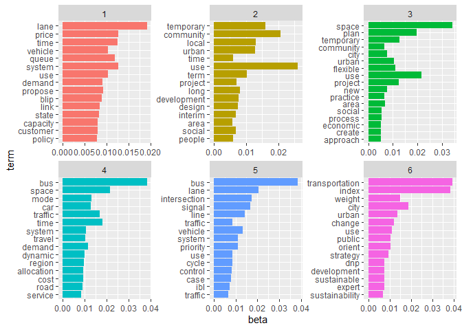

Full paper analysis - Topic Modelling and bigrams
================

## Import libraries

``` r
library(tm)
library(NLP)
library(stringr)
library(topicmodels)
library(tidytext)
library(tidyverse)
library(ggplot2)
library(dplyr)
library(SnowballC)
library(textstem)
```

## Import dataset

After downloading the papers we converted to “.txt” files and manually
removed: information of the authors and journal, acknowledgments,
funding, supplemental material, disclosure statement, references.

> Note: This prior data cleaning ensures that the information provided
> by the model was only from the paper’s text body.

``` r
folder <- "Data\\Full papers for LDA_bigrams"

filelist <- list.files(folder, pattern = ".txt") #select only documents ".txt"

filelist <- paste(folder, "\\", filelist, sep="") #Join documents.  

x <- lapply(filelist, FUN = readLines) #Considers each line as a different element (document). 

docs <- lapply(x, FUN = paste, collapse = " ")
```

#### Data cleaning

``` r
#Remove punctuation
text <- gsub(pattern = "\\W", replace = " ", docs)
#Remove Numbers (digits)
text2 <- gsub(pattern = "\\d", replace = " ", text)
#Lowercase words
text3 <- tolower(text2)
#remove single words 
text4 <- gsub(pattern = "\\b[A-z]\\b{1}", replace = " ", text3) 
#Remove whitespace
text5 <- stripWhitespace(text4)
#Lematize terms in its dictionary form
text6 <- lemmatize_strings(text5, dictionary = lexicon::hash_lemmas)

adicional_stopwords <- c("good","represent", "present", "different","london", "may","datum","taipei", "numb", "much", "one", "two", "can", "fig", "will", "arm", "along", "xpj", "figure", "thus","aviv", "tel", "dsc","dscs","traf","also","study", stopwords("en"))
#remove stopwords
text7 <- removeWords(text6, adicional_stopwords)

# Remove words for bigrams
new_stopwords <- c("ow", "exible", "cantly","wick", "exibility", "uence", "uences", "ned")
text_bigram <- removeWords(text7, new_stopwords)
```

#### Create corpus

``` r
corpus <- Corpus(VectorSource(text7))
```

### Topic modelling - Latent Dirichlet Allocation (LDA)

#### Create Document-Term-Matrix (DTM)

``` r
dtm <- DocumentTermMatrix(corpus) 
str(dtm)
```

    ## List of 6
    ##  $ i       : int [1:12694] 1 1 1 1 1 1 1 1 1 1 ...
    ##  $ j       : int [1:12694] 1 2 3 4 5 6 7 8 9 10 ...
    ##  $ v       : num [1:12694] 1 5 1 1 6 1 1 1 4 1 ...
    ##  $ nrow    : int 12
    ##  $ ncol    : int 5145
    ##  $ dimnames:List of 2
    ##   ..$ Docs : chr [1:12] "1" "2" "3" "4" ...
    ##   ..$ Terms: chr [1:5145] "ability" "able" "abstract" "accept" ...
    ##  - attr(*, "class")= chr [1:2] "DocumentTermMatrix" "simple_triplet_matrix"
    ##  - attr(*, "weighting")= chr [1:2] "term frequency" "tf"

##### count ten words that appear more frequently

``` r
dtm.matrix <- as.matrix(dtm)
wordcount <- colSums(dtm.matrix)
topten <- head(sort(wordcount, decreasing=TRUE), 10)
print(topten)
```

    ##            bus            use          space           time           lane 
    ##            867            652            612            478            425 
    ##         system        traffic           city transportation          urban 
    ##            408            397            330            327            320

#### Define the number of topics (k)

``` r
k <- 6
```

> Note: The number of topics is defined prior to the model.

#### Run LDA using Gibbs sampling

``` r
ldaOut <- LDA(dtm,
             k, 
             method="Gibbs", 
             control=list(seed = 42)) 

lda_topics <- ldaOut %>%
  tidy(matrix = "beta") %>%
          arrange(desc(beta))
```

#### select 15 most frequent terms in each topic

``` r
word_probs <- lda_topics %>%
  group_by(topic) %>%
  top_n(15, beta) %>%
  ungroup() %>%
  #Create term2, a factor ordered by word probability
  mutate(term2 = fct_reorder(term, beta))
```

#### Plot the topics

``` r
ggplot(
  word_probs,
  aes(term2,beta,fill = as.factor(topic))
) + geom_col(show.legend = FALSE) +
  # Facet the bar plot by topic
  facet_wrap(~ topic, scales = "free") +
  coord_flip() +
  labs(x = "term")
```

<!-- -->

> Note: If you run the algorithm many times, the topics will maintain
> the same. Nonetheless, the order of the topics may appear differently
> which is coherent to the “bag of words” assumption.

### Bigrams

#### Import Libraries

``` r
library(quanteda)
library(igraph)
library(ggraph)
library(tidyverse)
library(tidyr)
library(broom)
```

#### Create dataframe

``` r
df_corpus <- data.frame(text_bigram)
```

#### Create bigrams by separating words in sequences of 2

``` r
bigrams_df <- df_corpus %>%
  unnest_tokens(output = bigram,
                input = text_bigram,
                token = "ngrams",
                n = 2)
```

#### Count bigrams

``` r
bigrams_df %>%
  count(bigram, sort = TRUE)
```

#### Separate words into two columns

``` r
bigrams_separated <- bigrams_df %>%
  separate(bigram, c("word1", "word2"), sep = " ")
```

#### Remove stopwords

``` r
bigrams_filtered <- bigrams_separated %>%
  filter(!word1 %in% stop_words$word) %>%
  filter(!word2 %in% stop_words$word)
```

#### Count the number of times two words are always together

``` r
bigram_counts <- bigrams_filtered %>%
  count(word1, word2, sort = TRUE)
```

#### Create network of bigrams

``` r
bigram_network <- bigram_counts %>%
  filter(n > 15) %>% #filter for the most common combinations of bigrams that appear at least 15 times.
  graph_from_data_frame()
```
